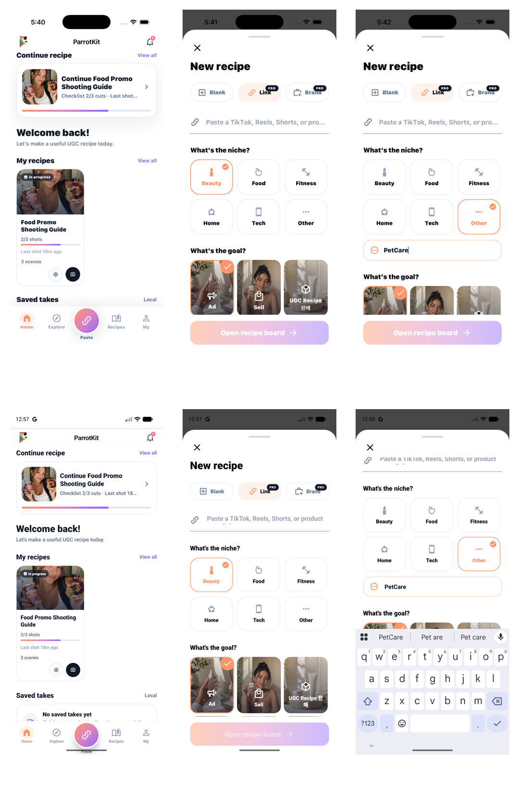

# Issue 8 Native Capture Board

## 대상

- GitHub issue: `#8` Restore recipe drawer goal grid and remove box-in-box
- Commit baseline: `main@4ac0881`
- Date: 2026-05-16

## 목적

Issue #8의 남은 QA checklist를 닫기 위해 iPhone과 Android에서 recipe creation drawer, goal grid, Other input evidence를 모았다.

## Evidence

Capture board:

Individual artifacts:

- `output/playwright/issue-8-native-capture-20260516/ios-00-home-existing.png`
- `output/playwright/issue-8-native-capture-20260516/ios-01-drawer-existing.png`
- `output/playwright/issue-8-native-capture-20260516/ios-02-other-petcare-existing.png`
- `output/playwright/issue-8-native-capture-20260516/android-00-home.png`
- `output/playwright/issue-8-native-capture-20260516/android-01-drawer.png`
- `output/playwright/issue-8-native-capture-20260516/android-02-other-visible.png`
- `output/playwright/issue-8-native-capture-20260516/android-04-other-petcare-keyboard.png`
- `output/playwright/issue-8-native-capture-20260516/issue-8-capture-board.png`

## 결과

- PASS: Drawer opens as bottom modal/sheet on Android.
- PASS: Drawer evidence exists for iPhone from the current main QA artifact set.
- PASS: Dim backdrop, drag handle, close affordance, title, Blank/Link/Brand tabs, niche grid, goal grid, and primary CTA are visible.
- PASS: Niche tiles do not contain inner icon boxes.
- PASS: Goal image cards render three per row on phone width.
- PASS: Other reveals custom niche input.
- PASS: Android custom input accepts `PetCare`.
- PASS: iPhone custom input evidence shows `PetCare`.

## Commands

- `EXPO_NO_TELEMETRY=1 npx expo start --go --port 8083 --localhost`
- `~/Library/Android/sdk/emulator/emulator -avd Pixel_9 -no-snapshot-load`
- `~/Library/Android/sdk/platform-tools/adb reverse tcp:8083 tcp:8083`
- `~/Library/Android/sdk/platform-tools/adb shell am start -a android.intent.action.VIEW -d 'exp://127.0.0.1:8083' host.exp.exponent`
- `~/Library/Android/sdk/platform-tools/adb exec-out screencap -p`
- `ffmpeg ... issue-8-capture-board.png`

## iPhone Note

Fresh `simctl openurl` and `simctl io ... screenshot` attempts hung in this run even after restarting Simulator/CoreSimulator. The iPhone evidence included in the board is the existing Expo Go iPhone evidence already produced from the same current `main@4ac0881` flow and copied into this issue-specific output folder. The missing new evidence for #8 was Android; that was captured fresh on `Pixel_9`.

## Residual Risk

- Native iOS dev-client build remains blocked by the previously documented Xcode linker issue. Expo Go iPhone evidence is still valid for this drawer UI flow.
